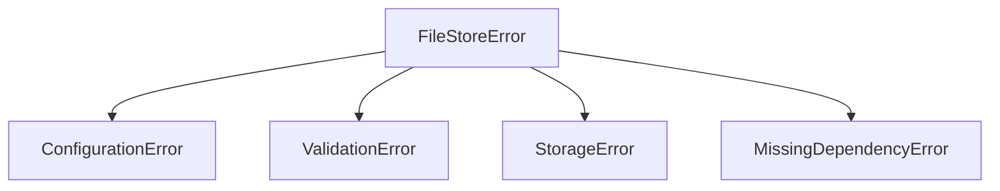

# Error Handling

filestore uses a structured exception hierarchy and never crashes your endpoint with unhandled exceptions.

## Design Philosophy

- **Validation failures** are captured per-file in `FileData.error` — they don't raise exceptions
- **Configuration errors** raise immediately at setup time
- **Backend failures** are caught and wrapped into failed `FileData` results
- **Unexpected errors** are logged and returned as a failed `Store`

## Exception Hierarchy



All exceptions inherit from `FileStoreError`:

```python
from filestore import (
    FileStoreError,        # Base
    ConfigurationError,    # Bad config
    ValidationError,       # File rejected
    StorageError,          # Backend failed
    MissingDependencyError,# Missing extra
)
```

## Graceful Failure Pattern

```python
from fastapi import Depends, HTTPException
from filestore import LocalStorage, Store

storage = LocalStorage(name="file", required=True, config={"destination": "uploads"})

@app.post("/upload")
async def upload(store: Store = Depends(storage)):
    if not store.status:
        raise HTTPException(
            status_code=422,
            detail={"errors": store.errors, "message": store.message},
        )
    file_data = store.first("file")
    return {"url": file_data.url}
```

## Catching All Filestore Errors

```python
try:
    storage = LocalStorage(name="", config={"destination": "uploads"})
except FileStoreError as err:
    print(f"Setup failed: {err}")
```
