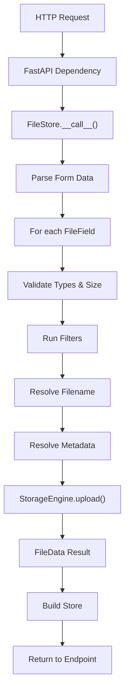

# User Guide

The user guide covers every feature of **filestore** in depth. If you haven't already, start with the [Quick Start](../getting-started/quickstart.md).

## Topics

| Guide | Description |
|-------|-------------|
| [Storage Backends](backends.md) | Local, memory, S3, GCS, and Azure — configuration and behavior |
| [Validation](validation.md) | File size limits, extension filters, content-type checks |
| [Callbacks](callbacks.md) | Dynamic filenames, destinations, filters, and metadata |
| [Multi-Field Uploads](multi-field.md) | Handling multiple upload fields per request |
| [Reading Results](results.md) | Working with `Store` and `FileData` objects |
| [Error Handling](errors.md) | Exception hierarchy and graceful failure patterns |

## Architecture Overview

Every step in the pipeline is configurable through the `Config` dictionary or callbacks.
